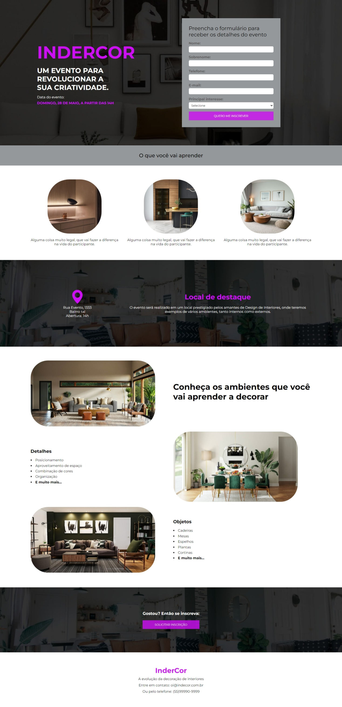

<h1>
        
</h1>

## 👩🏽‍💻 Sobre o Projeto Indercor

Mas um projeto pronto !!

Mas um projeto pronto, que desafio eu me desafiei a fazer ele do zero, buscando não ler o material de apoio colocando meu conhecimento a prova, foi desafiador e motivante. Posso dizer que consultei 10% do meu material de apoio é uma grande avanço. Neste projeto eu trabalhei no desenvolvimento completo do HTML , CSS do site.

Este projeto é responsivo, adaptável a qualquer tamanho de tela.

## 👩🏽‍💻 Tecnologia Utilizada

O projeto foi desenvolvido com as seguintes tecnologias

- HTML

- CSS

- Figma

## 👩🏽‍💻 Acesse o projeto

 <h3>
        <a href="https://lyrisnunes.github.io/site-pizzaria/"> - Veja o projeto clique aqui </a>
</h3>